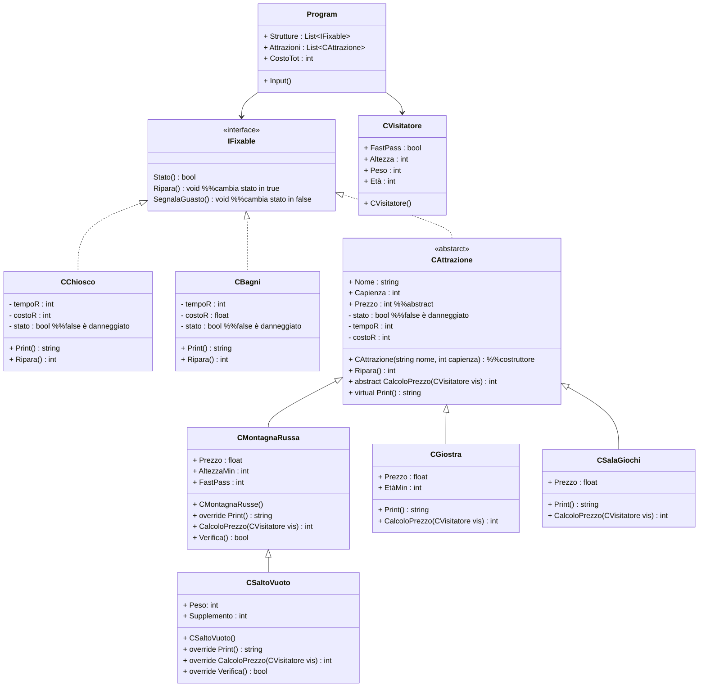

```mermaid
classDiagram

    %% CLASSI PRINCIPALI
    
    class Program{
        + Strutture : List~IFixable~
        + Attrazioni : List~CAttrazione~
        + CostoTot : int
        

        + Input()
    }

    class IFixable{
        <<interface>>
        Stato() bool
        Ripara() void %%cambia stato in true
        SegnalaGuasto() void %%cambia stato in false
    }


    class CVisitatore{
        + FastPass : bool
        + Altezza : int
        + Peso : int
        + Età : int
        
        + CVisitatore()
    }

    class CChiosco{
        - tempoR : int
        - costoR : int
        - stato : bool %%false è danneggiato

        + Print() string
        + Ripara() int
    }

    class CBagni{
        - tempoR : int
        - costoR : float
        - stato : bool %%false è danneggiato

        + Print() string
        + Ripara() int
    }

    class CAttrazione{
        <<abstarct>>
        + Nome : string
        + Capienza : int
        + Prezzo : int %%abstract
        - stato : bool %%false è danneggiato
        - tempoR : int
        - costoR : int

        + CAttrazione(string nome, int capienza)  %%costruttore
        + Ripara() int
        + abstract CalcoloPrezzo(CVisitatore vis) int
        + virtual Print() string
    }

    class CMontagnaRussa{
        + Prezzo : float
        + AltezzaMin : int
        + FastPass : int

        + CMontagnaRusse()
        + override Print() string
        + CalcoloPrezzo(CVisitatore vis) int
        + Verifica() bool
    }

    class CSaltoVuoto{
        + Peso: int
        + Supplemento : int

        + CSaltoVuoto()
        + override Print() string
        + override CalcoloPrezzo(CVisitatore vis) int
        + override Verifica() bool
    }

    class CGiostra {
        + Prezzo : float
        + EtàMin : int

        + Print() string
        + CalcoloPrezzo(CVisitatore vis) int
    }

    class CSalaGiochi {
        + Prezzo : float

        + Print() string
        + CalcoloPrezzo(CVisitatore vis) int

    }

    

    %% INTERFACCIA
    IFixable <|.. CChiosco
    IFixable <|.. CAttrazione
    IFixable <|.. CBagni

    %%ENUMERAZIONI
    

    

    %% CLASSE ASTRATTA
    CAttrazione <|-- CMontagnaRussa
    CAttrazione <|-- CGiostra
    CAttrazione <|-- CSalaGiochi
    CMontagnaRussa <|-- CSaltoVuoto

    %% Program usa le classi ma non le possiede
    Program --> IFixable
    Program --> CVisitatore
```
