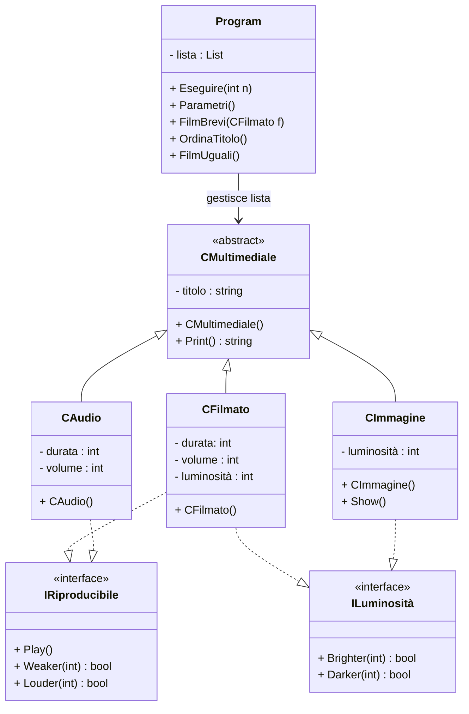

```mermaid
classDiagram
    direction TB
class Program{
    - lista : List<CMultimediale> 

    + Eseguire(int n)
    + Parametri()
    + FilmBrevi(CFilmato f)
    + OrdinaTitolo()
    + FilmUguali()
}

class CMultimediale{
    <<abstract>>
    - titolo : string

    + CMultimediale()
    + Print() string
}

class CImmagine{
    - luminosità : int

    + CImmagine()
    + Show()
}

class CAudio{
    - durata : int
    - volume : int

    + CAudio()
}

class CFilmato{
    - durata: int
    - volume : int
    - luminosità : int

    + CFilmato()
}

class IRiproducibile{
    <<interface>>
    + Play()
    + Weaker(int) bool
    + Louder(int) bool
}

class ILuminosità{
    <<interface>>
    + Brighter(int) bool
    + Darker(int) bool
}

%%RELAZIONI

Program --> CMultimediale : gestisce lista
CMultimediale <|-- CFilmato
CMultimediale <|-- CAudio
CMultimediale <|-- CImmagine

%%INTERFACCE
CFilmato ..|> IRiproducibile
CFilmato ..|> ILuminosità
CAudio ..|> IRiproducibile
CImmagine ..|> ILuminosità 


```